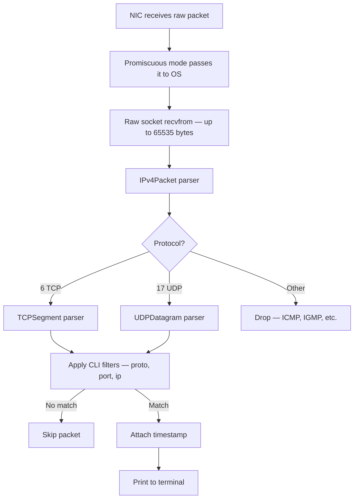

# packet-sniffer

A lightweight Windows network packet sniffer written in Python using raw sockets. Captures live IPv4 traffic and decodes TCP and UDP packets with timestamps and CLI filters — no external libraries required.

---

## Table of Contents

- [Promiscuous Mode](#promiscuous-mode)
- [How It Works](#how-it-works)
- [Packet Flow](#packet-flow)
- [Project Structure](#project-structure)
- [Requirements](#requirements)
- [Usage](#usage)
- [CLI Filters](#cli-filters)
- [What Gets Captured](#what-gets-captured)
- [Limitations](#limitations)
- [Learning Goals](#learning-goals)

---

## Promiscuous Mode

By default, a network interface only passes packets addressed to its own MAC address up to the operating system. Everything else is discarded at the hardware level — your machine simply ignores traffic meant for other devices on the same network.

Promiscuous mode disables that filter. When enabled, the NIC forwards every packet it sees on the wire to the OS, regardless of the destination address. This is what tools like Wireshark use under the hood.

On Windows, promiscuous mode is activated by sending an IOCTL command (`SIO_RCVALL`) to a raw socket:

```python
sniffer.ioctl(socket.SIO_RCVALL, socket.RCVALL_ON)
```

This requires Administrator privileges. Without elevation, the call either silently fails or raises a `PermissionError`. The sniffer disables promiscuous mode in a `finally` block to ensure the interface is restored cleanly even if the program crashes.

---

## How It Works

The sniffer opens a raw socket bound to the local machine's IP, then enables promiscuous mode to capture all passing traffic. Each received buffer is handed to a parser based on the protocol number in the IPv4 header:

1. **`IPv4Packet`** — strips the 20-byte IP header using `struct.unpack` to extract TTL, protocol number, source IP, and destination IP.
2. **`TCPSegment`** — parses the TCP header to pull out ports, sequence/ack numbers, and all six flag bits (FIN, SYN, RST, PSH, ACK, URG) via bitwise operations.
3. **`UDPDatagram`** — parses the fixed 8-byte UDP header to extract ports, length, and checksum.

Both TCP and UDP packets are decoded and printed. Everything else is silently dropped.

```
[*] Sniffer started on 192.168.1.5. Listening for traffic...
[14:23:01.231] TCP | 192.168.1.5:54231   -> 142.250.182.46:443  | Flags: [SYN]
[14:23:01.245] TCP | 142.250.182.46:443  -> 192.168.1.5:54231   | Flags: [SYN+ACK]
[14:23:01.246] TCP | 192.168.1.5:54231   -> 142.250.182.46:443  | Flags: [ACK]
[14:23:01.312] UDP | 192.168.1.5:51204   -> 8.8.8.8:53          | Len: 45
[14:23:01.330] UDP | 8.8.8.8:53          -> 192.168.1.5:51204   | Len: 128
[14:23:01.892] TCP | 192.168.1.5:54231   -> 142.250.182.46:443  | Flags: [FIN+ACK]
```

---

## Packet Flow



---

## Project Structure

```
packet-sniffer/
├── main.py            # Socket setup, promiscuous mode, CLI filters, capture loop
└── packet_models.py   # IPv4Packet, TCPSegment, and UDPDatagram parsers
```

---

## Requirements

- **Windows only** — uses `socket.SIO_RCVALL` (Windows IOCTL) for promiscuous mode
- Python 3.x
- No third-party dependencies — only the standard library (`socket`, `struct`, `argparse`, `datetime`)

---

## Usage

> [!WARNING]
> **This script must be run as Administrator.** Raw sockets and promiscuous mode require elevated privileges on Windows. Running without them will either raise a `PermissionError` immediately or silently capture nothing.

```bash
python main.py
```

Press `Ctrl+C` to stop. Promiscuous mode is automatically disabled on exit.

---

## CLI Filters

All filters are optional and can be combined.

| Flag | Type | Description |
|------|------|-------------|
| `--proto` | `tcp` or `udp` | Show only the specified protocol |
| `--port` | integer | Show only packets where src or dst port matches |
| `--ip` | string | Show only packets where src or dst IP matches |

```bash
python main.py                               # capture everything
python main.py --proto tcp                   # TCP only
python main.py --proto udp                   # UDP only
python main.py --port 443                    # any protocol on port 443
python main.py --ip 8.8.8.8                  # all traffic to/from Google DNS
python main.py --ip 8.8.8.8 --proto udp     # UDP traffic to/from Google DNS
python main.py --ip 8.8.8.8 --port 53       # DNS queries to/from Google DNS
```

---

## What Gets Captured

| Field            | Parsed From        | Notes                                       |
|------------------|--------------------|---------------------------------------------|
| Source IP        | IPv4 header        | Formatted as dotted decimal                 |
| Destination IP   | IPv4 header        | Formatted as dotted decimal                 |
| TTL              | IPv4 header        | Captured but not printed                    |
| Protocol         | IPv4 header        | Used to route to TCP or UDP parser          |
| Source Port      | TCP / UDP header   |                                             |
| Destination Port | TCP / UDP header   |                                             |
| Sequence Number  | TCP header         | Captured but not printed                    |
| ACK Number       | TCP header         | Captured but not printed                    |
| FIN flag         | TCP header bitmask | Bit 0 — clean connection close              |
| SYN flag         | TCP header bitmask | Bit 1 — connection start                    |
| RST flag         | TCP header bitmask | Bit 2 — connection reset                    |
| PSH flag         | TCP header bitmask | Bit 3 — push data immediately               |
| ACK flag         | TCP header bitmask | Bit 4 — acknowledgment                      |
| URG flag         | TCP header bitmask | Bit 5 — urgent data                         |
| UDP Length       | UDP header         | Total length of header + payload in bytes   |
| UDP Checksum     | UDP header         | Captured but not printed                    |
| Payload          | After header       | Captured but not displayed                  |

---

## Limitations

- **Windows only** — Linux and macOS use a different interface for raw sockets (`AF_PACKET` on Linux); `SIO_RCVALL` does not exist there
- No ICMP support — ping and traceroute traffic is silently dropped
- Payload data is captured but not displayed
- No output to file or pcap format

---

## Learning Goals

Built to understand how network packets are structured at the byte level — specifically:

- IPv4 and TCP/UDP header layout and `struct` unpacking with format strings
- TCP flag extraction via bitwise operations on a 16-bit field
- Raw socket setup and promiscuous mode on Windows
- CLI argument parsing with `argparse`